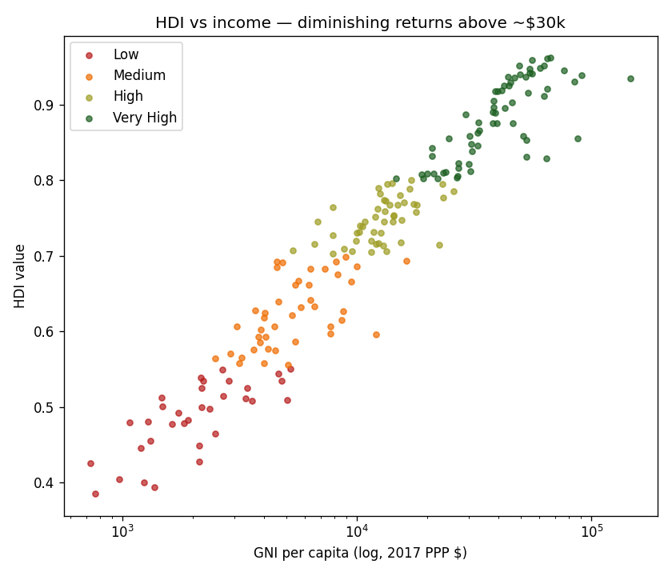
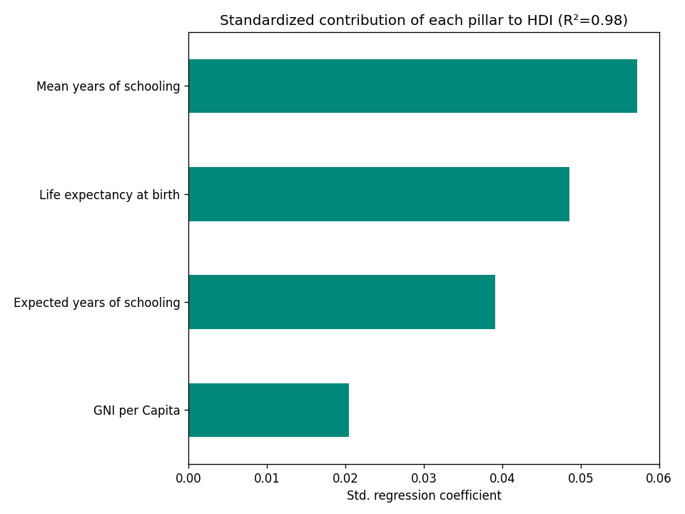

# Human Development Index — Global Policy Analysis 🌍

**An exploratory and analytical study of the UN's Human Development Index across 195 countries (HDR 2021–22): what drives human development, and which countries outperform their income.**

[](https://github.com/Nikkat-Afrin/hdi-global-policy-analysis/actions/workflows/ci.yml)   
 [](LICENSE)

---

## 💼 Why this matters
The **Human Development Index (HDI)** condenses a country's health, education, and income into a single 0–1 score that policymakers and NGOs use to compare progress and target aid. This project explores the 2021–22 data, then goes further: it **quantifies how much each pillar drives HDI** and flags countries that achieve more human development than their income alone would predict — a direct input to development-policy conversations.

## 📊 Dataset
UNDP **Human Development Report 2021–22 — Statistical Annex (Table 1)**, `data/HDR21-22_HDI.csv` (bundled): **195 countries × 9 columns** — HDI rank & value, life expectancy at birth, expected & mean years of schooling, GNI per capita (2017 PPP $), and GNI-rank-minus-HDI-rank.

## 🔬 Methodology
1. **EDA notebook** ([`notebooks/hdi_analysis.ipynb`](notebooks/hdi_analysis.ipynb)) — cleaning, distribution and ranking visualizations of HDI and its components.
2. **Policy-insights layer** ([`src/hdi_insights.py`](src/hdi_insights.py)):
   - classify countries into the four **UNDP development tiers**,
   - standardized **linear regression of HDI on its pillars** to compare each pillar's contribution,
   - **over/under-performer** analysis using GNI-rank − HDI-rank.

## 📈 Key findings

- **Tier distribution:** Very High **65** · High **50** · Medium **43** · Low **33** countries.
- **What drives HDI?** A standardized regression explains **R² = 0.98** of HDI variation. Ranked by standardized contribution: **Mean years of schooling (0.057) ≳ Life expectancy (0.049) > Expected schooling (0.039) > GNI per capita (0.021)** — i.e. **education and health move the index more than raw income** does, and income shows clear diminishing returns above ~$30k.
- **Punching above their income** (highest GNI-rank − HDI-rank): **Cuba (+37), Tonga (+34), Barbados (+26), Kyrgyzstan (+26), Samoa (+24)** — strong human-development outcomes relative to economic resources, a model for cost-effective social policy.

<p align="center">
  
  
</p>

## ▶️ How to run
```bash
pip install -r requirements.txt
jupyter lab notebooks/hdi_analysis.ipynb     # EDA + visualizations
python src/hdi_insights.py                    # tiers, pillar regression, over-performers
```

## 🛠️ Tech stack
`Python` · `pandas` · `scikit-learn` · `Matplotlib` · `Seaborn`

## 🚀 Future improvements
- Choropleth world maps of HDI and each pillar (GeoPandas).
- Time-series of HDI trajectories (multi-year HDR data) and convergence analysis.

---
*Academic project (DAV 5400, Project 1), extended with development-tier classification and a pillar-contribution regression. Data © UNDP Human Development Report Office.*


## 🌍 Interactive dashboard (`src/build_dashboard.py` → `docs/index.html`)

A zero-server interactive dashboard built from the raw UNDP table — world HDI choropleth, the classic GNI-vs-HDI development scatter (marker size = life expectancy), top/bottom-15 ranking, and the largest expected-vs-attained schooling gaps.

```bash
python src/build_dashboard.py    # regenerates docs/index.html (~100 KB, plotly.js from CDN)
pytest tests/                    # build + data-cleaning tests (CI on every push)
```

**Live version: <https://nikkat-afrin.github.io/hdi-global-policy-analysis/>** (GitHub Pages, deployed from `main`/`docs`). The build is fully reproducible from `data/HDR21-22_HDI.csv`; the tests caught (and now guard against) the raw export's comma-formatted GNI values silently becoming NaN.
